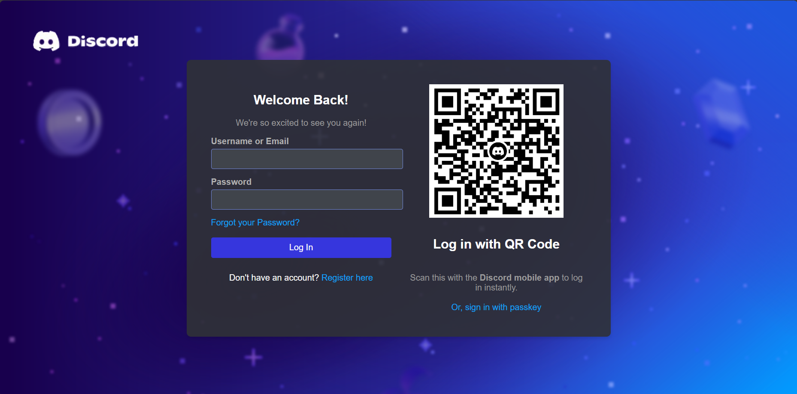

# Discord Login Phishing Page
 Phishing page based on Login Page of Discord. Use only for educational purposes.

 # Discord Login Page Clone

This is a clone of the Discord login page, created using HTML and CSS for educational purposes. It replicates the layout of the original Discord login page, including features like the QR code login option.

## Project Overview

This project includes:
- A responsive login form for the Discord platform.
- QR code section for instant login using the Discord mobile app.
- Simple styling mimicking the original Discord design.

### Features
- **Username or Email Login**: Users can input their email or phone number to log in.
- **Password Input**: A standard password field with secure input.
- **QR Code Login**: A QR code that users can scan with their Discord mobile app to log in instantly.

### Screenshots


### File Structure
- `index.html`: Contains the HTML structure for the page.
- `styles.css`: Contains the CSS styling for the page (you can inline it within the HTML).
- `bg.png`: Background image of the login page.
- `q.png`: QR code image used for login with a mobile device.
- `t1.png`: Discord logo displayed in the top-left corner.

### How to Use
1. Clone this repository:
   ```bash
   git clone 

# Technologies Used

### HTML5: For creating the structure of the login page.
### CSS3: For styling and making the page responsive.
### Git: Version control to track changes and collaborate.

# License

This project is licensed under the MIT License.

# Disclaimer

This project is for educational purposes only and is not affiliated with Discord.

